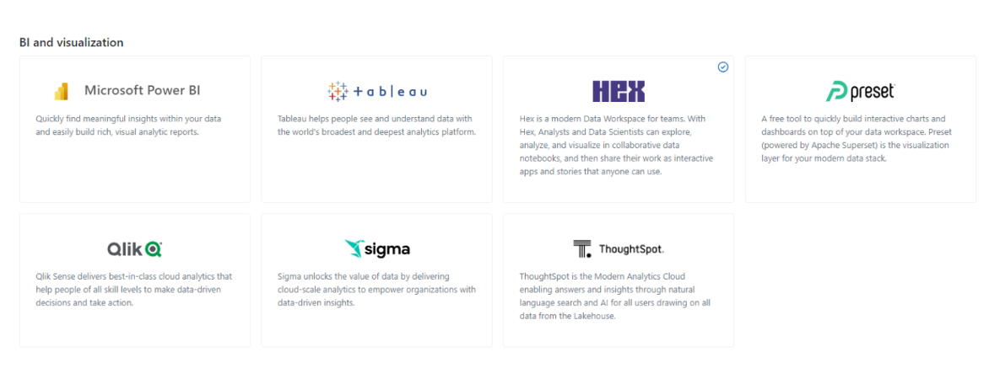

## Dashboards

### Objectif

Nous avons besoin d'améliorer notre compréhension et notre gestion de projets en termes de data science et de visualisation de données. Voici les principaux domaines d'intérêt :

- **Compréhension des scores et modèles** : Visualisation interactive des résultats pour un client, incluant les facteurs explicatifs.
- **Accélération de projets en data science** : Utilisation de démonstrateurs pour montrer notre capacité à réaliser des projets au sein de Groupama.
- **Utilisation de technologies externes** : Adoption de packages et de solutions open source pour accélérer nos projets.
- **Outils d'analyse explicative** : Utilisation d'outils tels que Shapash pour dégager des règles à implémenter.

### Processus de Recherche et Découverte

Après plusieurs réunions pour affiner et comprendre techniquement nos besoins, nous avons établi les interprétations suivantes des besoins et des solutions techniques possibles, comme illustré dans la Figure ci-dessous.

### Solutions Explorées

Nous avons testé plusieurs solutions disponibles sur le marché. Les résultats ont montré que certaines plateformes comme Power BI répondent partiellement à nos besoins en visualisation de données et permettent l'exécution de scripts Python. Cependant, elles ne facilitent pas l'accès à un notebook Python pour l'explicabilité des modèles avec des bibliothèques comme "shap.

### Décisions et Mise en Place

Nous avons ensuite exploré d'autres solutions telles que HEX, Dataiku et Databricks. Malgré les contraintes liées à la sécurité et la confidentialité des données, qui nous ont empêchés de poursuivre avec Hex, Dataiku et Databricks ont prouvé leur efficacité pour répondre à nos besoins.

### Implémentation et Gestion

Nous utilisons désormais Dataiku et Databricks comme solutions internes, tout en prenant en compte les restrictions de licence et la gestion des comptes. La gestion de la création et de la suppression des comptes chez Databricks doit être rigoureusement surveillée pour éviter des coûts inutiles, et chez Dataiku, nous avons un nombre limité de "Readers".

### Suivi Continu

Ce sujet est toujours en cours d'évolution. Nous nous efforçons de simplifier les processus de création de comptes, de partage de tableaux de bord et de gestion des accès. Une partie de ma mission est de tester et de démontrer les fonctionnalités de Dataiku et Databricks pour assurer une compréhension et une adoption uniformes au sein de Groupama.

